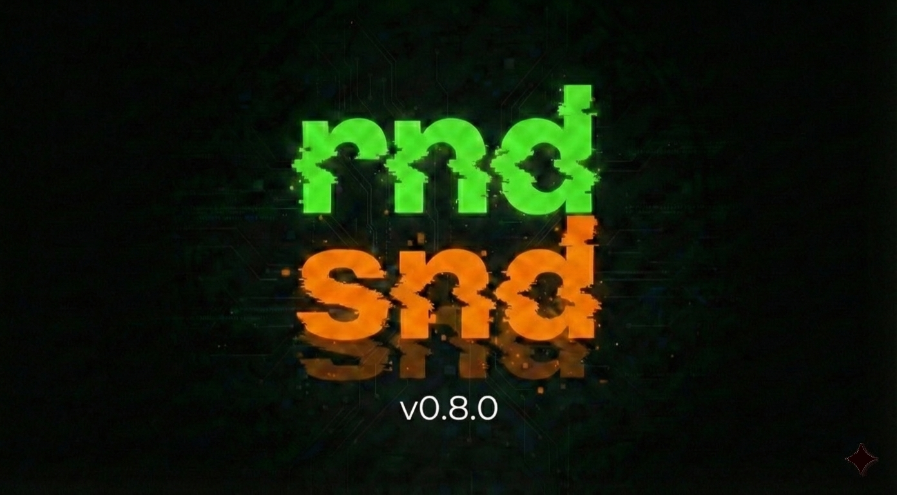

# 🔊 rndsnd v0.6.5
### AI-Powered Audio Manager & Generative Mixer



> **[🇮🇹]** Una workstation audio desktop che utilizza l'IA per catalogare automaticamente i campioni, generare mix creativi e velocizzare il workflow.
>
> **[🇬🇧]** A desktop audio workstation that uses AI to auto-tag samples, generate creative mixes, and speed up the workflow.

---

## 📥 DOWNLOAD (App Pronta / Ready-to-use)

**Non vuoi toccare il codice? / Don't want to code?**
Scarica l'app pronta all'uso per Linux (file `.tar.gz`) dalla sezione Releases. Basta estrarre ed eseguire il file `rndsnd`.
*Download the ready-to-use Linux app (.tar.gz) from Releases. Just extract and run the `rndsnd` executable.*

👉 **[VAI AI DOWNLOAD / GO TO DOWNLOADS](https://github.com/Nasosecco/rndsnd/releases)**

---

## ✨ CARATTERISTICHE / FEATURES

### 🇮🇹 Italiano
* **Neural Tagging (PANNs):** Analisi automatica tramite IA (modello Cnn14) con 527 classi di riconoscimento (es. "Guitar", "Rain", "Kick"). *Funziona offline su CPU.*
* **Generative Mixer:** Crea collage sonori casuali o filtrati per tag, esportando un log `.txt` dettagliato delle tracce usate.
* **Editor Rapido:** Visualizzazione forma d'onda, zoom fluido e **Drag & Drop** per trascinare selezioni audio direttamente nella tua DAW.

### 🇬🇧 English
* **Neural Tagging (PANNs):** Automatic AI analysis (Cnn14 model) with 527 recognition classes. *Works offline on CPU.*
* **Generative Mixer:** Create random or tag-filtered sound collages, exporting a detailed `.txt` log of the tracks used.
* **Fast Editor:** Waveform visualization, smooth zoom, and **Drag & Drop** to export audio selections directly into your DAW.

---

## 👨‍💻 ESECUZIONE DA SORGENTE / RUN FROM SOURCE

Segui questi passi se vuoi avviare l'app dal codice Python senza compilarla.
*Follow these steps to run the Python app directly.*

### 1. Prerequisiti / Prerequisites
* **Python 3.9+**
* **FFmpeg** (Necessario per leggere mp3/wav / Required for audio):
  `sudo apt install ffmpeg`

### 2. Installazione / Installation

```bash
# 1. Clona il repository / Clone repo
git clone [https://github.com/Nasosecco/rndsnd.git](https://github.com/Nasosecco/rndsnd.git)
cd rndsnd

# 2. Crea ambiente virtuale / Create venv
python3 -m venv venv
source venv/bin/activate

# 3. Installa dipendenze / Install dependencies
pip install PySide6 librosa matplotlib pydub soundfile panns-inference torch numpy
